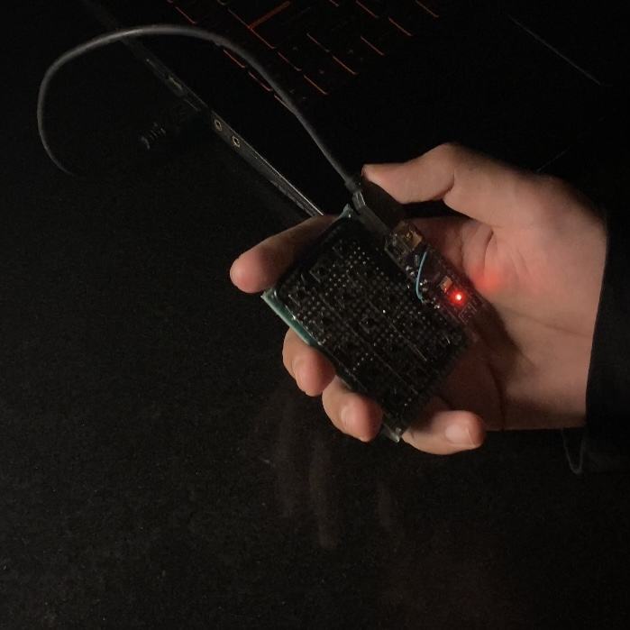
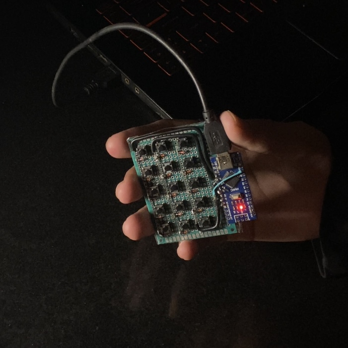

# MIDI Pad V1

A custom 3×5 USB MIDI pad built from scratch using an Arduino Nano.

  
  

[v1 Demo video](https://x.com/0xkozue/status/2076754242774368724?s=20)

## Features
- 3×5 switch matrix
- Custom Arduino firmware
- USB MIDI output
- Works with FL Studio and other DAWs

## Hardware
- Arduino Nano
- 15 Tactile Switches
- 15 Diodes
- USB Cable
- Perorated borad

## Future Plans
- Ccustom PCB with cool silkscreen art.
- Double the size.
- Mechanical switches instead of tactile ones.
- Rotary encoders + sliders.
- Better USB-C integration.
- A proper enclosure.
- LEDs?? maybe
- Cleaner firmware with layers, macros, and way more customization.

If you build one or have ideas to improve it, feel free to open an issue or a pull request!
